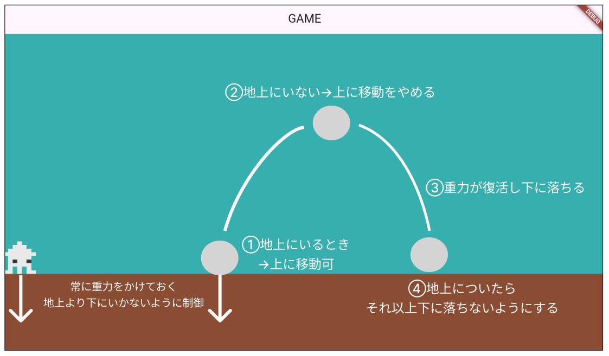

# **プレーヤーのジャンプの動き**

## **動きの仕組みを整理**



### **重力をかける**

**【player.dart】**

```dart
class Player extends SpriteComponent
    with HasGameRef<MainGame>, KeyboardHandler {
  Vector2 velocity = Vector2.zero();
  final double moveSpeed = 200;
  final double jumpForce = 400; // ジャンプ力
  final double gravity = 800; // ①重力の量
  bool isOnGround = false; // ②地面にいるかの判定

  //省略

  // ①常に重力をかける
  void applyGravity(double dt, double gravity) {
    // 地上にいない時
    if (!isOnGround) {
      velocity.y += gravity * dt; // 重力を適用して下降
    }
    position += velocity * dt; // 速度に基づいてキャラクターの位置を更新
  }

  // fps毎に動かす
  @override
  void update(double delta) {
    super.update(delta);

    // ①重力を適用
    applyGravity(delta, gravity);

    position += velocity * delta;
  }


```

このままだと下に落ちてしまう

## **地上にいるかどうかの判定**

**【player.dart】**

```dart

  // ②地面との接触
  void checkGroundCollision() {
    // 地上より下の場合
    if (position.y >= screenSize.y - size.y / 2 - screenSize.y / 4) {
      isOnGround = true;

      position.y = screenSize.y - size.y / 2 - screenSize.y / 4;
      velocity.y = 0;
    } else {
      //空中にいる時
      isOnGround = false;
    }
  }

  // fps毎に動かす
  @override
  void update(double delta) {
    super.update(delta);

    // 重力を適用
    applyGravity(delta, gravity);
    // ②地面との衝突を確認
    checkGroundCollision(); 

    position += velocity * delta;
  }

```

## **ジャンプした時**

```dart

// ジャンプ
  void jump() {
    //地上にいる時だけ
    if (isOnGround) {
      velocity.y = -jumpForce;
      isOnGround = false; // ジャンプ中は地面にいない
    }
  }

```