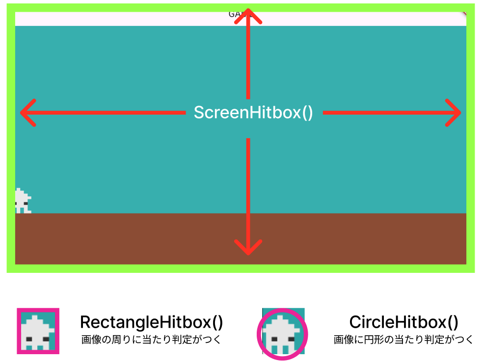

# **壁に当たった時**

## **左の壁で止まるようにする**

**【player.dart】**

**考え方**

特定の位置にきたら、それ以上進まないようpositionを固定する

```dart

@override
  void update(double delta) {
    super.update(delta);

    applyGravity(delta, gravity); // 重力を適用
    checkGroundCollision(); // 地面との衝突を確認

    // ①スクリーン左よりも先に進めないようにする
    if (position.x < size.x / 2) {
      position.x = size.x / 2;
    }

    position += velocity * delta;
  }

```

**position**：playreの位置  
position.xはX座標の位置、position.yはY座標の位置を示している

## **右の壁に当たった時、プレーヤーリセット**

### **①当たり判定用のコンポーネント追加**

**【game.dart】**

```dart
import 'package:flame/game.dart';
import 'package:flame/input.dart';
import 'package:flame/components.dart'; //①当たり判定用
import 'package:flutter/material.dart';
import 'screen.dart';
import 'player.dart';

late Vector2 screenSize;

//①当たり判定用（HasCollisionDetection追加）
class MainGame extends FlameGame
    with HasKeyboardHandlerComponents, HasCollisionDetection {

  //省略

  @override
  Future<void> onLoad() async {
    await super.onLoad();

    // ①当たり判定用のコンポーネント
    await add(ScreenHitbox());

    // 背景の設定
    await ScreenRemove();
    // プレーヤーの設定
    await PlayerRemove();
  }

  //省略
```

**【player.dart】**

**②コンポーネント追加**

```dart

import 'package:flame/components.dart';
import 'package:flame/collisions.dart'; //②当たり判定用
import 'package:flutter/services.dart';
import 'game.dart';
import 'setting.dart';


// ②当たり判定用（CollisionCallbacksを追加）
class Player extends SpriteComponent
    with HasGameRef<MainGame>, KeyboardHandler, CollisionCallbacks {

  Vector2 velocity = Vector2.zero();
  final double moveSpeed = 200; // 移動速度
  final double jumpForce = 400; // ジャンプ力
  final double gravity = 800; // 重力の量
  bool isOnGround = false; // 地面にいるかの判定

  @override
  Future<void> onLoad() async {
    sprite = await Sprite.load('ika2.png');
    size = Vector2(PLAYER_SIZE_X, PLAYER_SIZE_Y);
    position = Vector2(size.x / 2, Y_GROUND_POSITION - size.y / 2);
    anchor = Anchor.center;
    priority = 10;
    add(RectangleHitbox()); //②当たり判定用
    await super.onLoad();
  }

```




|  Hitbox  |  説明  | 使用方法  |
| :---- | :---- | ---- |
| RectangleHitbox  |  長方形の当たり判定を持つHitbox  |  矩形のキャラクターやブロック、壁などの当たり判定に適している  |
| CircleHitbox  |  円形の当たり判定を持つ  |  円や球体に近いキャラクターやオブジェクトに適している  |
| PolygonHitbox  |  カスタムの頂点を指定して多角形で判定  |  特殊な形状や多角形の当たり判定が必要な場合に使用  |
| CompositeHitbox  |  複数のHitboxを組み合わせて一つの当たり判定にする  |  複雑な形状を構築し、さまざまな部分に異なる当たり判定を設定する必要がある場合  |
| ConvexPolygonHitbox  |  凸多角形の形状に限定された多角形  |  凸多角形の当たり判定が必要な場合  |

<br><br>

**③当たり判定の関数を追加**


```dart

  //省略

  // ③当たり判定枠だけ作る
  @override
  // 当たった瞬間の処理（スコア計算などはここ）
  void onCollisionStart(
    Set<Vector2> intersectionPoints,
    PositionComponent other,
  ) {
    
    super.onCollisionStart(intersectionPoints, other);
  }

  @override
  // 当たっている間の処理（壁に当たっているとき同じところに留まるなどはここ）
  void onCollision(Set<Vector2> intersectionPoints, PositionComponent other) {
    
    super.onCollision(intersectionPoints, other);
  }

  @override
  // 当たり終わったら
  void onCollisionEnd(PositionComponent other) {
    
    super.onCollisionEnd(other);
  }

  //省略

```

**④当たり判定**

```dart
class Player extends SpriteComponent
    with HasGameRef<MainGame>, KeyboardHandler, CollisionCallbacks {

  bool isCollidedScreenHitboxX = false; //④
  Vector2 velocity = Vector2.zero();
  final double moveSpeed = 200; // 移動速度
  final double jumpForce = 400; // ジャンプ力
  final double gravity = 800; // 重力の量
  bool isOnGround = false; // 地面にいるかの判定

//省略

@override
  // 当たっている間の処理（壁に当たっているとき同じところに留まるなどはここ）
  void onCollision(Set<Vector2> intersectionPoints, PositionComponent other) {
    //④壁に当たったら
    if (other is ScreenHitbox) {
      final screenHitBoxRect = other.toAbsoluteRect();

      //当たるかどうかを常に監視
      for (final point in intersectionPoints) {
        //右の壁に当たったらプレーヤーを消す
        if (point.x == screenHitBoxRect.right && !isCollidedScreenHitboxX) {
          isCollidedScreenHitboxX = true;
          //自分を消す→onRemove関数に飛ぶ
          removeFromParent();
        }
      }
    }
    super.onCollision(intersectionPoints, other);
  }

  @override
  // 当た理終わったら
  void onCollisionEnd(PositionComponent other) {
    isCollidedScreenHitboxX = false; //④
    super.onCollisionEnd(other);
  }

```

isCollidedScreenHitboxXで当たっているかどうか判定している

**⑤当たった時の処理（プレーヤー）**

```dart
@override
  Future<void> onRemove() async {
    // ⑤もう一度プレーヤーを出す
    await gameRef.PlayerRemove();

    super.onRemove();
  }


```