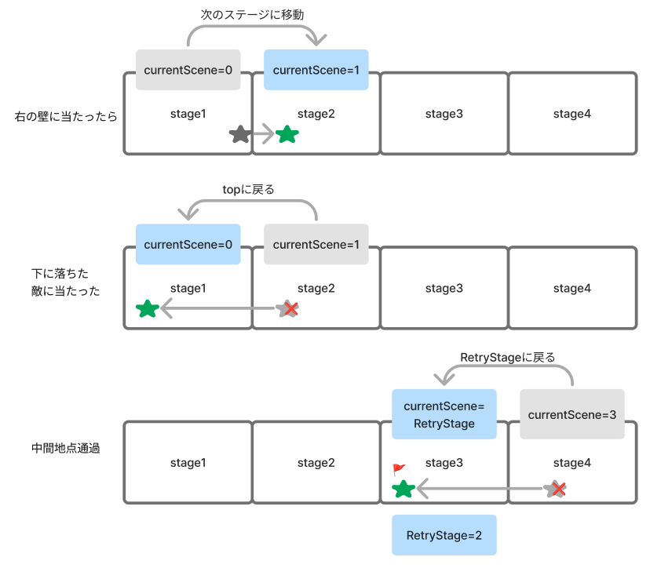

# **文字を描画する**

## **ステージの表示**


**【setting.dart】**

### **①表示用データを追加**

```dart

List<String> SceneText = [
  'stage1',
  'stage2',
  'stage3',
  'stage4',
  'stage5',
  'stage6',
  'stage7',
  'stage8',
  'stage9',
];

```

**【text.dart】**

### **②文字表示用のdartを作成**

```dart

import 'package:flutter/services.dart';
import 'package:flutter/material.dart';
import 'package:flame/components.dart';
import 'game.dart';
import 'setting.dart';

class NextText extends TextComponent with HasGameRef<MainGame> {
  @override
  Future<void> onLoad() async {
    position = Vector2(0, 0);
    text = "${SceneText[0]}";

    textRenderer = TextPaint(
        style: TextStyle(
            fontSize: 30.0, fontWeight: FontWeight.bold, color: Colors.white));
  }

  @override
  Future<void> render(Canvas canvas) async {
    super.render(canvas);
  }
}

```

### **TextComponent**

|  プロパティ  |  説明  | 使用方法  |
| :---- | :---- | ---- |
|  position  |  表示位置（x,y）  |  position = Vector2(<X座標>, <Y座標>);  |
|  text  |  表示文字列  |  text = "<表示文字>"  |
|  textRenderer  |  文字の大きさや色などの指定  |  textRenderer =TextPaint(style: TextStyle(fontSize: 30.0, fontWeight: FontWeight.bold, color: Colors.white));  |
|  anchor  |  画像の基準位置  |  anchor = Anchor.center;<br>anchor = Anchor.topLeft;<br>anchor = Anchor.bottomLeft;<br>など |

このほかにも`scale` ,`angle`,`maxWidth` ,`isVisible`などを指定できます  

**【game.dart】**

### **③文字表示用class呼び出し**

```dart

import 'text.dart';

```

```dart

  @override
  Future<void> onLoad() async {
    await super.onLoad();

    // 当たり判定用のコンポーネント
    await add(ScreenHitbox());

    // 背景の設定
    await ScreenRemove();
    // プレーヤーの設定
    await PlayerRemove();
    // ③テキストの描画
    await TextRemove();
  }

  // 背景の描画
  Future<void> ScreenRemove() async {
    await add(BackScreen());
    await add(ground());
  }

  // プレーヤーの描画
  Future<void> PlayerRemove() async {
    await add(Player());
  }

  // ③テキストの描画
  Future<void> TextRemove() async {
    await add(NextText());
  }

```

## **ステージの移動**



**【game.dart】**

### **④現在のステージと戻るステージを管理**

```dart

// シーンを管理
var currentScene = 0;
// 途中ステージ保存
var RetryStage = 0;

```

**【player.dart】**

右の壁に当たったらステージ更新

```dart

void onCollision(Set<Vector2> intersectionPoints, PositionComponent other) {
    //壁に当たったら
    if (other is ScreenHitbox) {
      final screenHitBoxRect = other.toAbsoluteRect();

      //当たるかどうかを常に監視
      for (final point in intersectionPoints) {
        //右の壁に当たったらプレーヤーを消す
        if (point.x == screenHitBoxRect.right && !isCollidedScreenHitboxX) {
          isCollidedScreenHitboxX = true;
          // ④次のステージ行く
          currentScene++;
          //自分を消す→onRemove関数に飛ぶ
          removeFromParent();
        }
      }
    }
    super.onCollision(intersectionPoints, other);
  }

  @override
  // 当た理終わったら
  void onCollisionEnd(PositionComponent other) {
    isCollidedScreenHitboxX = false;
    super.onCollisionEnd(other);
  }

  // 消えた時の処理
  @override
  Future<void> onRemove() async {
    await gameRef.PlayerRemove();
    //④テキストの更新
    await gameRef.TextRemove();

    super.onRemove();
  }

```

**【text.dart】**

```dart

class NextText extends TextComponent with HasGameRef<MainGame> {
  @override
  Future<void> onLoad() async {
    position = Vector2(0, 0);
    //④
    text = "${SceneText[currentScene]}";

    textRenderer = TextPaint(
        style: TextStyle(
            fontSize: 30.0, fontWeight: FontWeight.bold, color: Colors.white));
  }

  @override
  Future<void> render(Canvas canvas) async {
    super.render(canvas);
  }
}

```

文字が重なってしまうので、描画の前にリセット


**【game.dart】**

```dart

  // テキストの描画
  Future<void> TextRemove() async {
    // ④テキストクリア
    children.whereType<NextText>().forEach((text) {
      text.removeFromParent();
    });
    await add(NextText());
  }

```

## **ステージの更新**

### **⑤ステージ毎にオブジェクトの描画**

**【game.dart】**

```dart 

//省略

  Future<void> TextRemove() async {
    children.whereType<NextText>().forEach((text) {
      text.removeFromParent();
    });
    await add(NextText());
  }

// ⑤ステージ毎にオブジェクトの描画
  Future<void> objectRemove() async {
    switch (currentScene) {
      case 1:
          //ステージに表示するオブジェクトをここに追加
        break;
      default:
    }
  }

```