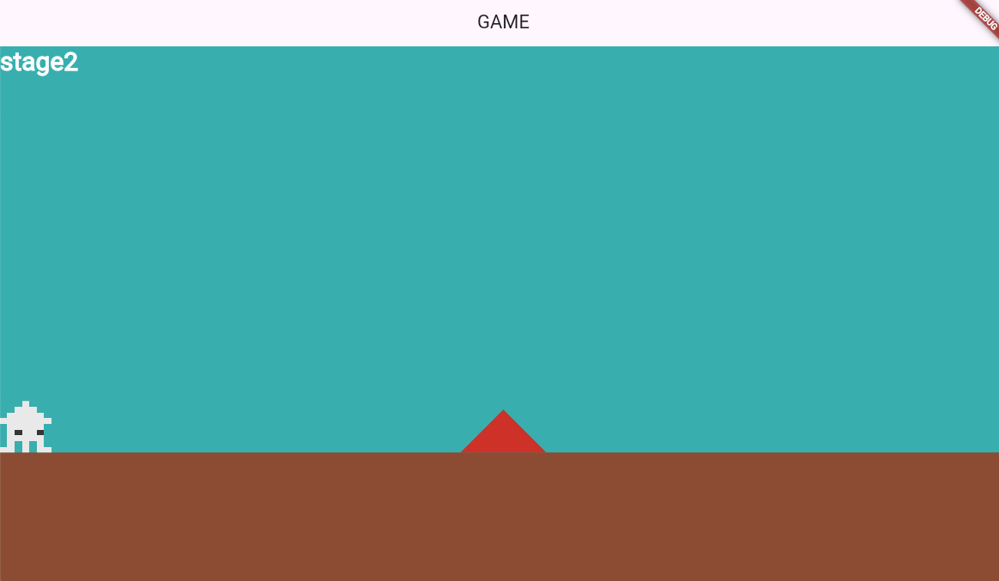
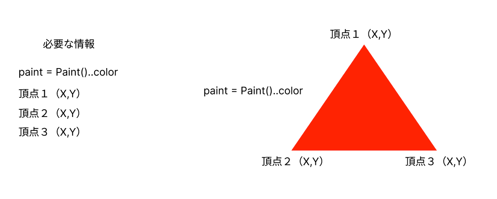
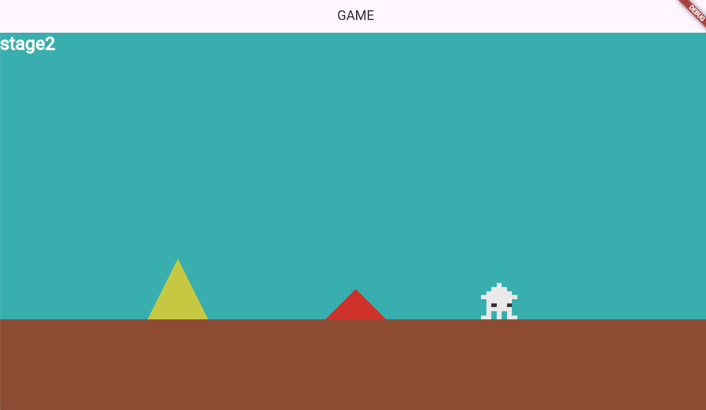
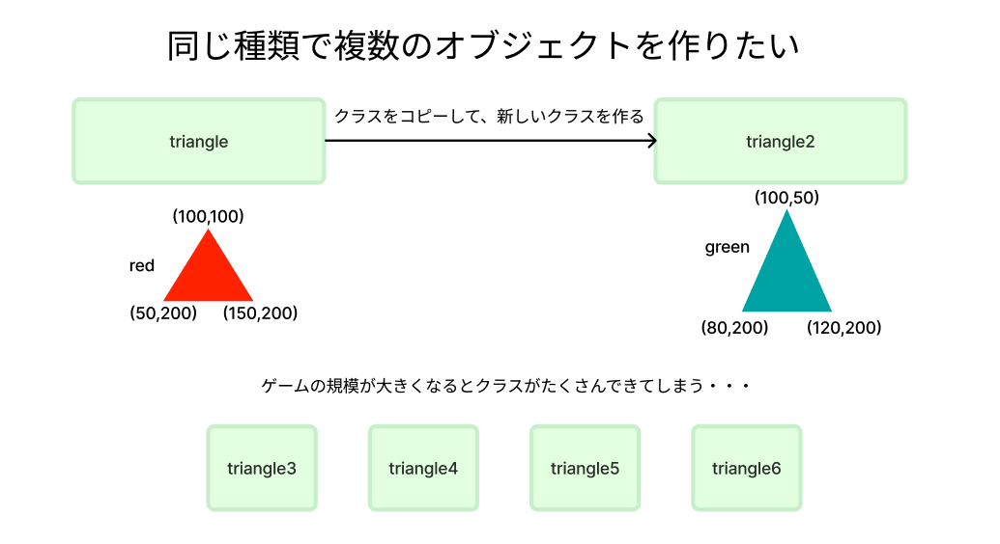
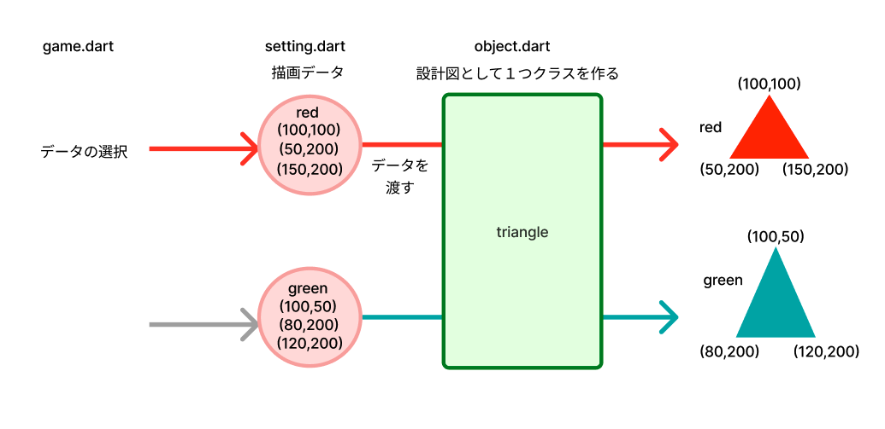
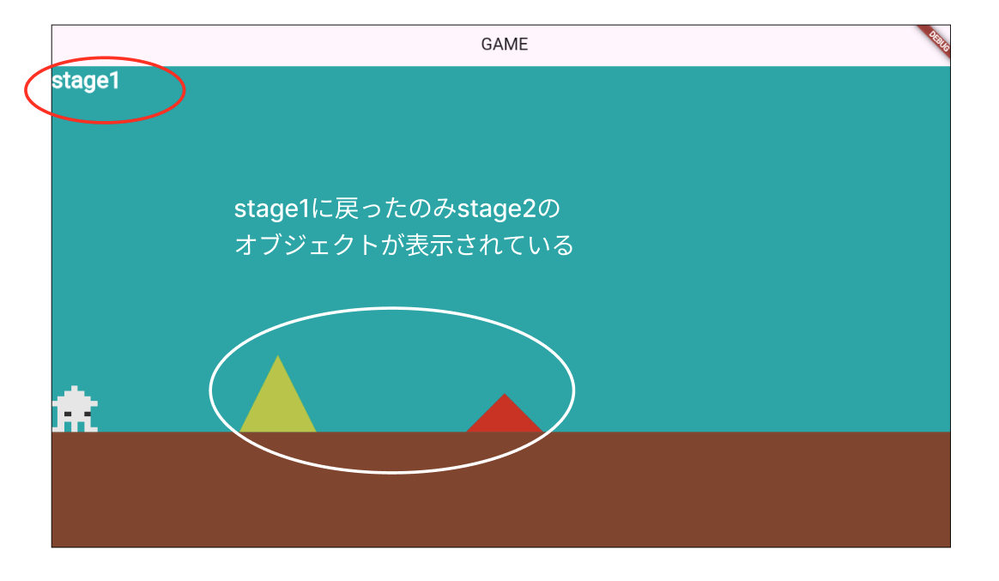

# **障害物の描画と当たり判定**

## **オブジェクトの制御**




**【game.dart】**

各ステージに表示するオブジェクトを

### **①オブジェクト表示用**

```dart

import 'setting.dart';
import 'object.dart';

```

```dart

// オブジェクトの描画
  Future<void> objectRemove() async {
    switch (currentScene) {
      case 1:
        //① オブジェクト（三角形用）関数呼び出し
        await add(triangle());
        break;
      default:
    }
  }


```

**【object.dart】**

### **②オブジェクト表示用のdartを作成**



```dart

class triangle extends RectangleComponent
    with HasGameRef<MainGame>, CollisionCallbacks {
  @override
  Future<void> onLoad() async {
    paint = Paint()..color = Color.fromARGB(255, 211, 46, 46);

    anchor = Anchor.topCenter;

    add(PolygonHitbox([
      Vector2(screenSize.x / 2, Y_GROUND_POSITION - 50),
      Vector2(screenSize.x / 2 - 50, Y_GROUND_POSITION),
      Vector2(screenSize.x / 2 + 50, Y_GROUND_POSITION),
    ])
      ..collisionType = CollisionType.passive);
  }

  @override
  Future<void> render(Canvas canvas) async {
    super.render(canvas);
    final path = Path();
    path.moveTo(screenSize.x / 2, Y_GROUND_POSITION - 50); // 頂点
    path.lineTo(screenSize.x / 2 - 50, Y_GROUND_POSITION); // 左下
    path.lineTo(screenSize.x / 2 + 50, Y_GROUND_POSITION); // 右下
    path.close(); // 閉じる

    // パスをキャンバスに描画
    canvas.drawPath(path, paint);
  }
}

```

**【player.dart】**

### **③オブジェクト呼び出し**

```dart

@override
  Future<void> onRemove() async {
    await gameRef.PlayerRemove();
    await gameRef.TextRemove();
    //③オブジェクト呼び出し
    await gameRef.objectRemove();

    super.onRemove();
  }

```

## **位置を変えてもう一つ表示する**



<br><br><br>



**ベースになるクラスを作り、描画データをクラスに渡す**  
**データは【setting.dart】に追加**



**【setting.dart】**

描画データをリストの型で設定

```dart

List<Map<String, dynamic>> trianglelist = [
  {
    "color": Color.fromARGB(255, 211, 46, 46),
    "pos1_x": screenSize.x / 2,
    "pos1_y": Y_GROUND_POSITION - 50,
    "pos2_x": screenSize.x / 2 - 50,
    "pos2_y": Y_GROUND_POSITION,
    "pos3_x": screenSize.x / 2 + 50,
    "pos3_y": Y_GROUND_POSITION
  },
  {
    "color": Color.fromARGB(255, 211, 203, 46),
    "pos1_x": screenSize.x / 4,
    "pos1_y": Y_GROUND_POSITION - 100,
    "pos2_x": screenSize.x / 4 - 50,
    "pos2_y": Y_GROUND_POSITION,
    "pos3_x": screenSize.x / 4 + 50,
    "pos3_y": Y_GROUND_POSITION
  }
];


```

**【game.dart】**

何番目のデータを使うか指定

```dart

Future<void> objectRemove() async {
    print("objectRemove");
    children.whereType<triangle>().forEach((text) {
      text.removeFromParent();
    });

    switch (currentScene) {
      case 1:
        //0番目のデータを使用
        await add(triangle(0));
        await add(triangle(1));
        break;
      default:
    }
  }

```

**【object.dart】**

`trianglelist`から指定のデータ番号のデータで描画する

```dart

class triangle extends RectangleComponent
    with HasGameRef<MainGame>, CollisionCallbacks {
  //データ番号を受け取る
  triangle(this.num);
  int num;

  @override
  Future<void> onLoad() async {
    print("triangle");
    paint = Paint()..color = trianglelist[num]["color"];

    anchor = Anchor.topCenter;

    add(PolygonHitbox([
      Vector2(trianglelist[num]["pos1_x"], trianglelist[num]["pos1_y"]),
      Vector2(trianglelist[num]["pos2_x"], trianglelist[num]["pos2_y"]),
      Vector2(trianglelist[num]["pos3_x"], trianglelist[num]["pos3_y"]),
    ])
      ..collisionType = CollisionType.passive);
  }

  @override
  Future<void> render(Canvas canvas) async {
    super.render(canvas);
    final path = Path();
    path.moveTo(trianglelist[num]["pos1_x"], trianglelist[num]["pos1_y"]); // 頂点
    path.lineTo(trianglelist[num]["pos2_x"], trianglelist[num]["pos2_y"]); // 左下
    path.lineTo(trianglelist[num]["pos3_x"], trianglelist[num]["pos3_y"]); // 右下
    path.close(); // 閉じる

    // パスをキャンバスに描画
    canvas.drawPath(path, paint);
  }
}

```


## **当たり判定**

**【player.dart】**

### **④障害物に当たったら負け**

```dart

import 'object.dart';

```

```dart

@override
  void onCollisionStart(
    Set<Vector2> intersectionPoints,
    PositionComponent other,
  ) {
    //④triangleと衝突
    if (other is triangle) {
      // 中間地点まで戻る(中間地点未到達の場合は０なのでスタートに戻る)
      currentScene = RetryStage;
      removeFromParent();
    }

    super.onCollisionStart(intersectionPoints, other);
  }

```



**【game.dart】**

### **⑤クリアしてから表示**

```dart

Future<void> objectRemove() async {
    //⑤オブジェクト削除
    children.whereType<triangle>().forEach((text) {
      text.removeFromParent();
    });
    
    switch (currentScene) {
      case 1:
        await add(triangle(0));
        await add(triangle(1));
      //省略
    }            
```