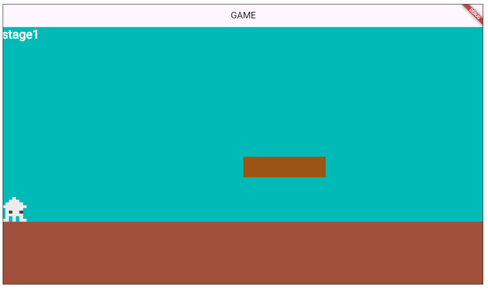
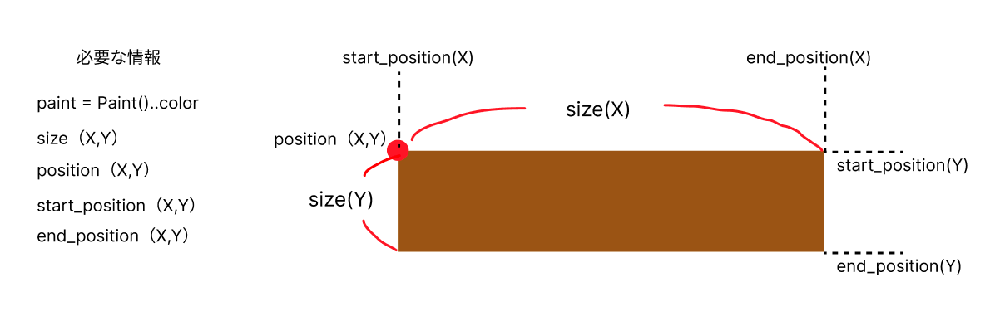
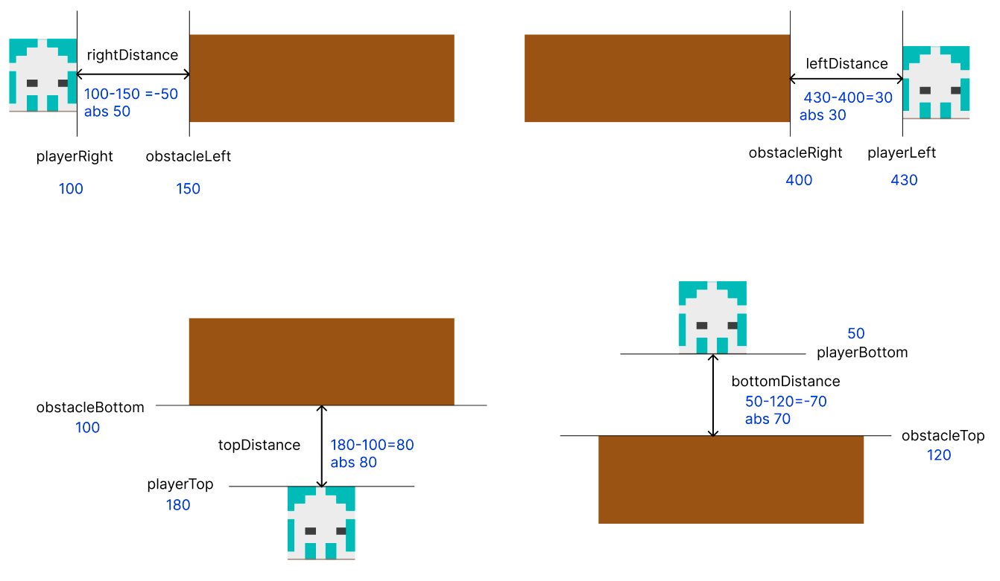
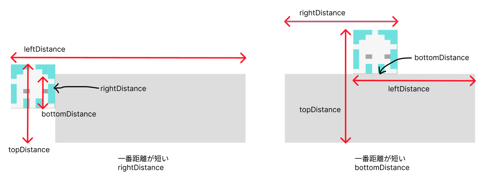
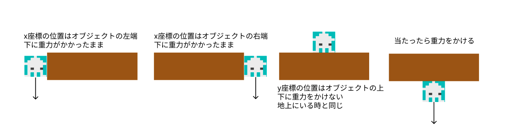

# **障害物とプレーヤーの位置**

## **障害物の上に乗る**





**【setting.dart】**

必要なデータをリストで作成

### **①データ作成**

```dart

List<Map<String, dynamic>> steplist = [
  {
    "idx": 0,
    "color": Color.fromARGB(255, 145, 87, 0),
    "size_x": 200,
    "size_y": 50,
    "pos_x": screenSize.x / 2,
    "pos_y": screenSize.y / 2,
    "start_pos_x": screenSize.x / 2 - PLAYER_SIZE_X / 2,
    "start_pos_y": screenSize.y / 2 - PLAYER_SIZE_Y / 2,
    "end_pos_x": screenSize.x / 2 + 200 + PLAYER_SIZE_X / 2,
    "end_pos_y": screenSize.y / 2 + PLAYER_SIZE_Y / 2,
  }
];

```

**【game.dart】**

### **②class呼び出し**

```dart

// オブジェクトの描画
  switch (currentScene) {
      case 0:
        await add(step(0));
        break;
      case 1:
        await add(triangle(0));
        await add(triangle(1));
        break;
      default:
    }


```

**【object.dart】**

### **　③stepオブジェクトを作成**

```dart

class step extends RectangleComponent
    with HasGameRef<MainGame>, CollisionCallbacks {
  step(this.num);
  int num;
  @override
  Future<void> onLoad() async {
    paint = Paint()..color = steplist[num]["color"];
    position = Vector2(steplist[num]["pos_x"], steplist[num]["pos_y"]);
    size = Vector2(steplist[num]["size_x"], steplist[num]["size_y"]);
    anchor = Anchor.topLeft;
    add(RectangleHitbox());
  }

  @override
  Future<void> render(Canvas canvas) async {
    super.render(canvas);
  }
}

```

**【player.dart】**

### **④当たり判定**

上に当たったら登れる  
下に当たったら跳ね返る

onCollision関数の中に書く

### **オブジェクトのどの位置に当たったかの判定**  

onCollisionでオブジェクトに当たったかどうか検知することができるが 
どの部分に当たったかは座標位置でしか判定することができない

**①各辺（上下左右）との距離を測る**



<br><br>

**②一番距離が短い辺が当たった場所**



<br><br>

**③当たった場所により処理を変える**



```dart

if (other is step) {
      for (final point in intersectionPoints) {
        // プレーヤーの各辺と障害物の各辺の位置を取得
        final playerRight = this.x + this.width;
        final playerLeft = this.x;
        final playerBottom = this.y + this.height;
        final playerTop = this.y;

        final obstacleRight = other.x + other.width + this.width/2;
        final obstacleLeft = other.x;
        final obstacleBottom = other.y + other.height;
        final obstacleTop = other.y;

        // 各方向の距離を計算
        final double rightDistance = (playerRight - obstacleLeft).abs();
        final double leftDistance = (playerLeft - obstacleRight).abs();
        final double bottomDistance = (playerBottom - obstacleTop).abs();
        final double topDistance = (playerTop - obstacleBottom).abs();

        // 最小の距離に基づいて衝突方向を判定
        double minDistance = [
          rightDistance,
          leftDistance,
          bottomDistance,
          topDistance
        ].reduce((a, b) => a < b ? a : b);

        if (minDistance == rightDistance) {
          //左から当たった
          position.x = other.x -this.width/2;
        } else if (minDistance == leftDistance) {
          //右から当たった
          position.x = other.x + other.width + this.width/2;
        } else if (minDistance == bottomDistance) {
          //上から当たった
          position.y = other.y - this.width / 2;
          velocity.y = 0;
          isOnGround = true;
        } else if (minDistance == topDistance) {
          //下から当たった
          velocity.y += gravity;
        }
      }
    }

```

### **【解説】**

```dart
double minDistance = [
          rightDistance,
          leftDistance,
          bottomDistance,
          topDistance
        ].reduce((a, b) => a < b ? a : b);
```

**reduce メソッド**  
- リストの要素を順に 2 つずつ比較して、1 つの結果にまとめる

**ラムダ式 (a, b) => a < b ? a : b**  
- a < b ? a : b は、a と b を比較して、小さい方の値を返す
- reduce はリストの先頭から順番に 2 つの要素を取り出し、このラムダ式で比較し、小さい方を次の要素と再び比較

<br><br><br>

