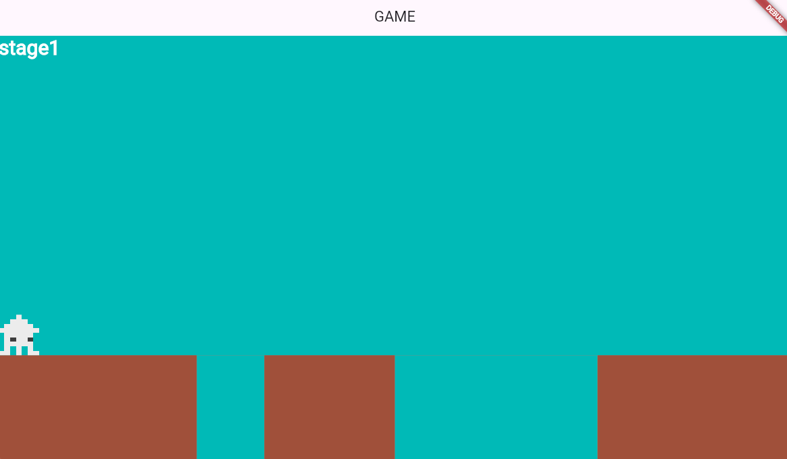
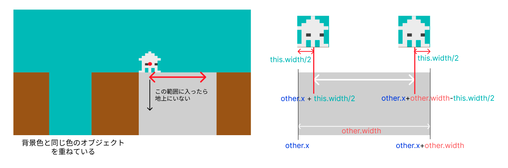

# **障害物とプレーヤーの位置**

## **落ちる**




**【setting.dart】**

必要なデータをリストで作成

### **①データ作成**

```dart

List<Map<String, dynamic>> holelist = [
  {
    "idx": 0,
    "color": Color.fromARGB(255, 68, 185, 183),
    "size_x": 300,
    "size_y": Y_GROUND_POSITION,
    "pos_x": screenSize.x / 2,
    "pos_y": Y_GROUND_POSITION,
    "start_pos_x": screenSize.x / 2 + PLAYER_SIZE_X / 2,
    "start_pos_y": Y_GROUND_POSITION,
    "end_pos_x": screenSize.x / 2 + 300 - PLAYER_SIZE_X / 2,
    "end_pos_y": Y_GROUND_POSITION,
  },
  {
    "idx": 1,
    "color": Color.fromARGB(255, 68, 185, 183),
    "size_x": 100,
    "size_y": Y_GROUND_POSITION,
    "pos_x": screenSize.x / 4,
    "pos_y": Y_GROUND_POSITION,
    "start_pos_x": screenSize.x / 4 + PLAYER_SIZE_X / 2,
    "start_pos_y": Y_GROUND_POSITION,
    "end_pos_x": screenSize.x / 4 + 100 - PLAYER_SIZE_X / 2,
    "end_pos_y": Y_GROUND_POSITION,
  },
];

```

**【game.dart】**

### **②class呼び出し**

```dart

// オブジェクトの描画
  switch (currentScene) {
      case 0:
        await add(hole(1));
        await add(hole(0));
        break;
      case 1:
        await add(triangle(0));
        await add(triangle(1));
        break;
      case 2:
        await add(step(0));
        await add(step(1));
        break;
      default:
    }


```

**【object.dart】**

### **　③holeオブジェクトを作成**

```dart

// 穴を作る
class hole extends RectangleComponent
    with HasGameRef<MainGame>, CollisionCallbacks {
  hole(this.num);
  int num;
  @override
  Future<void> onLoad() async {
    size = Vector2(holelist[num]["size_x"], holelist[num]["size_y"]);
    position = Vector2(holelist[num]["pos_x"], holelist[num]["pos_y"]);
    paint = Paint()..color = holelist[num]["color"];
    anchor = Anchor.topLeft;

    add(RectangleHitbox());
  }

  @override
  Future<void> render(Canvas canvas) async {
    super.render(canvas);
  }
}

```

**【player.dart】**

### **④当たり判定**



onCollisionでオブジェクトに当たったかどうか検知する

```dart

if (other is hole) {
  //上にいる時
  if (this.x > other.x + this.width / 2 &&
      this.x < other.x + other.width - this.width / 2) {
    isInHole = true;
    isOnGround = false;
    hole_X = this.x; //落ちた時のX座標を保持
  }
}

```

### **⑤空中にいるか落ちているか区別する**

```dart

void checkGroundCollision() {
    // ⑤!isInHoleを追加
    if (position.y >= screenSize.y - size.y / 2 - screenSize.y / 4 &&
        !isInHole) {
      //地上通常
      isOnGround = true;
      position.y = gameRef.size.y - size.y / 2 - gameRef.size.y / 4;
      velocity.y = 0;
    } else {
      // ⑤isInHoleの条件を追加
      if (isInHole) {
        //穴に落ちている時
        position.x = hole_X;
      } else {
        //空中
        isOnGround = false;
      }
    }
  }

 ``` 
