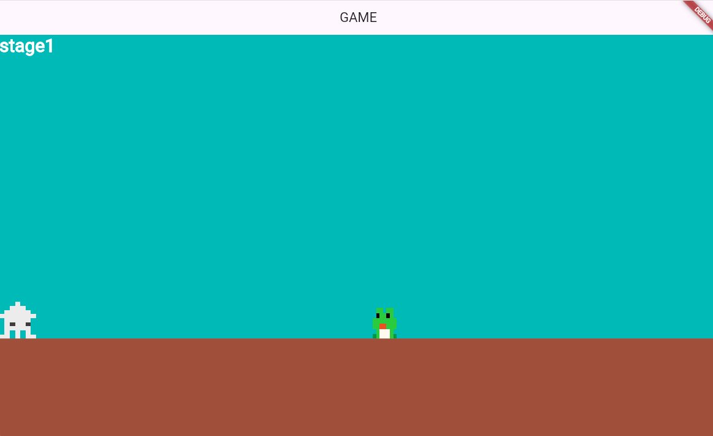
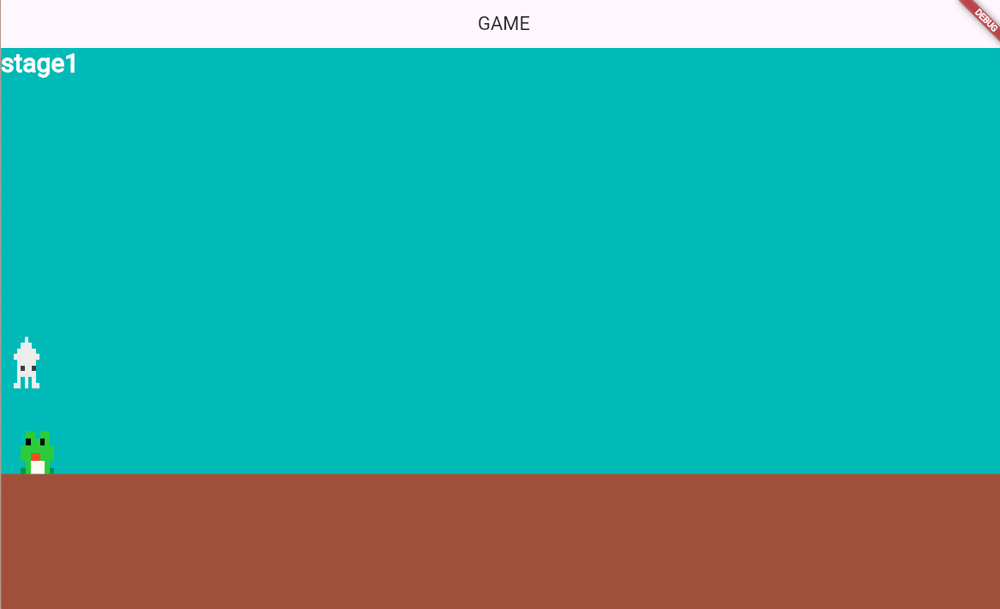
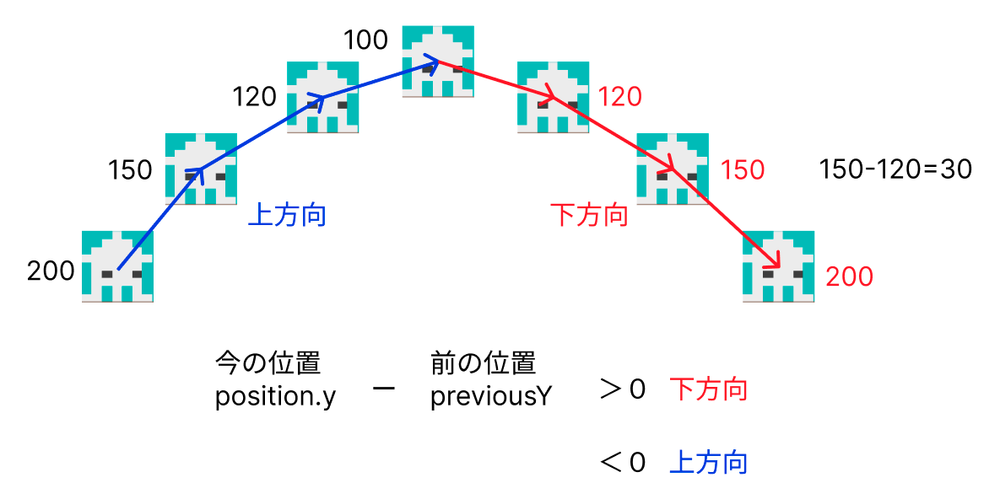

# **敵を出す**


## **敵の表示**




**【setting.dart】**

必要なデータをリストで作成

### **①データ作成**

```dart

List<Map<String, dynamic>> tekilist = [
  {
    "idx": 1,
    "color": Color.fromARGB(255, 68, 185, 183), //未使用
    "size_x": 50,                               //サイズ
    "size_y": 50,                               //サイズ
    "pos_x": screenSize.x - 300,                //初期位置
    "pos_y": Y_GROUND_POSITION - 500,           //初期位置
    "speed": -100,                              //スピード（マイナスは左方向に進む）
    "gravity": true,                            //重力かけるかどうか
    "right_img1": "kaeru.png",                  //画像ファイル
    "right_img2": "kaeru.png",
    "left_img1": "kaeru.png",
    "left_img2": "kaeru.png",
    "up_img1": "kaeru.png",
    "up_img2": "kaeru.png",
    "down_img1": "kaeru.png",
    "down_img2": "kaeru.png",
    "stop_img1": "kaeru.png",
    "stop_img2": "kaeru_up.png",
    "mini_img1": "kaeru_mini.png",
  },
  {
    "idx": 1,
    "color": Color.fromARGB(255, 68, 185, 183),
    "size_x": 50,
    "size_y": 50,
    "pos_x": screenSize.x + 100,
    "pos_y": Y_GROUND_POSITION - 200,
    "speed": -200,
    "gravity": false,
    "right_img1": "hato.png",
    "right_img2": "hato.png",
    "left_img1": "hato.png",
    "left_img2": "hato.png",
    "up_img1": "hato.png",
    "up_img2": "hato.png",
    "down_img1": "hato.png",
    "down_img2": "hato.png",
    "stop_img1": "hato.png",
    "stop_img2": "hato.png",
    "mini_img1": "hato.png",
  },
];

```

**【game.dart】**

### **②class呼び出し**

```dart
import 'teki.dart';
```

```dart

// オブジェクトの描画
  switch (currentScene) {
      case 0:
        await add(teki(0)); //追加
        await add(teki(1)); //追加
        break;
      case 1:
        await add(triangle(0));
        await add(triangle(1));
        await add(teki(0));
        break;
      case 2:
        await add(hole(0));
        await add(hole(1));
        await add(teki(0));
        break;
      case 3:
        await add(step(0));
        await add(step(1));
        await add(teki(0));
        break;
      default:
    }


```

**【teki.dart】**

### **③敵用のteki.dartファイルを作成**

player.dartの中身をコピーして変更する  
★の部分を参照して、修正、追加、コメントアウトする

```dart

import 'package:flame/components.dart';
import 'package:flame/collisions.dart';
import 'package:flutter/services.dart';
import 'game.dart';
import 'setting.dart';
import 'object.dart';

class teki extends SpriteAnimationComponent
    with HasGameRef<MainGame>, KeyboardHandler, CollisionCallbacks {
  // ★データから取得
  teki(this.count);
  int count;

  bool isCollidedScreenHitboxX = false;
  bool isCollidedScreenHitboxY = false;
  Vector2 velocity = Vector2.zero();
  //★ final double moveSpeed = 200; // 移動速度
  //★ final double jumpForce = 400; // ジャンプ力
  final double gravity = 800; // 重力の量
  bool isOnGround = false; // 地面にいるかの判定
  bool isInHole = false;
  double hole_X = 0.0;
  double tekimoveSpeed = 100; //★敵のスピード
  bool isGravity = true; //★重力かけるかどうか

  // 各方向のスプライト
  late SpriteAnimation leftAnimation;
  late SpriteAnimation rightAnimation;
  late SpriteAnimation upAnimation;
  late SpriteAnimation downAnimation;
  late SpriteAnimation stop_leftAnimation;
  late SpriteAnimation stop_rightAnimation;
  late SpriteAnimation stop_upAnimation;
  late SpriteAnimation stop_downAnimation;
  late SpriteAnimation miniAnimation; //★

  // 方向フラグ
  bool leftflg = false;
  bool upflg = false;
  bool downflg = false;
  bool rightflg = false;

  @override
  Future<void> onLoad() async {
    //スプライトロード
    final rightSprites = [
      await gameRef.loadSprite(tekilist[count]["right_img1"]), //★
      await gameRef.loadSprite(tekilist[count]["right_img2"]), //★
    ];
    final downSprites = [
      await gameRef.loadSprite(tekilist[count]["down_img1"]), //★
      await gameRef.loadSprite(tekilist[count]["down_img2"]), //★
    ];
    final upSprites = [
      await gameRef.loadSprite(tekilist[count]["up_img1"]), //★
      await gameRef.loadSprite(tekilist[count]["up_img2"]), //★
    ];
    final leftSprites = [
      await gameRef.loadSprite(tekilist[count]["left_img1"]), //★
      await gameRef.loadSprite(tekilist[count]["left_img2"]), //★
    ];
    final stop_rightSprites = [
      await gameRef.loadSprite(tekilist[count]["stop_img1"]), //★
      await gameRef.loadSprite(tekilist[count]["stop_img2"]), //★
    ];
    final stop_downSprites = [
      await gameRef.loadSprite(tekilist[count]["stop_img1"]), //★
      await gameRef.loadSprite(tekilist[count]["stop_img2"]), //★
    ];
    final stop_upSprites = [
      await gameRef.loadSprite(tekilist[count]["stop_img1"]), //★
      await gameRef.loadSprite(tekilist[count]["stop_img2"]), //★
    ];
    final stop_leftSprites = [
      await gameRef.loadSprite(tekilist[count]["stop_img1"]), //★
      await gameRef.loadSprite(tekilist[count]["stop_img2"]), //★
    ];
    final mini_Sprites = [
      await gameRef.loadSprite(tekilist[count]["mini_img1"]), //★
    ];

    // アニメーション（画像切り替え）
    rightAnimation = SpriteAnimation.spriteList(rightSprites, stepTime: 0.2);
    downAnimation = SpriteAnimation.spriteList(downSprites, stepTime: 0.2);
    upAnimation = SpriteAnimation.spriteList(upSprites, stepTime: 0.2);
    leftAnimation = SpriteAnimation.spriteList(leftSprites, stepTime: 0.2);

    stop_rightAnimation =
        SpriteAnimation.spriteList(stop_rightSprites, stepTime: 0.2);
    stop_downAnimation =
        SpriteAnimation.spriteList(stop_downSprites, stepTime: 0.2);
    stop_upAnimation =
        SpriteAnimation.spriteList(stop_upSprites, stepTime: 0.2);
    stop_leftAnimation =
        SpriteAnimation.spriteList(stop_leftSprites, stepTime: 0.2);

    miniAnimation = SpriteAnimation.spriteList(mini_Sprites, stepTime: 0.2);//★

    animation = stop_downAnimation;

    //★データから取ってくる
    tekimoveSpeed = tekilist[count]["speed"];
    velocity.x = tekimoveSpeed;
    isGravity = tekilist[count]["gravity"];
    size = Vector2(tekilist[count]["size_x"], tekilist[count]["size_y"]);
    position = Vector2(tekilist[count]["pos_x"], tekilist[count]["pos_y"]);
    anchor = Anchor.center;
    priority = 10;
    add(RectangleHitbox());
    await super.onLoad();
  }

  //★コメントアウトここから
  // キーボード操作
  // @override
  // bool onKeyEvent(
  //   KeyEvent event,
  //   Set<LogicalKeyboardKey> keysPressed,
  // ) {
  //   if (event is KeyDownEvent) {
  //     if (keysPressed.contains(LogicalKeyboardKey.arrowLeft)) {
  //       leftflg = true;
  //       upflg = false;
  //       downflg = false;
  //       rightflg = false;
  //       moveLeft();
  //     } else if (keysPressed.contains(LogicalKeyboardKey.arrowRight)) {
  //       leftflg = false;
  //       upflg = false;
  //       downflg = false;
  //       rightflg = true;
  //       moveRight();
  //     } else if (keysPressed.contains(LogicalKeyboardKey.space)) {
  //       leftflg = false;
  //       upflg = false;
  //       downflg = false;
  //       rightflg = false;
  //       jump();
  //     }
  //   } else if (event is KeyUpEvent) {
  //     stopMovement();
  //   }
  //   return true;
  // }

  // // 左移動
  // void moveLeft() {
  //   velocity.x = -moveSpeed;
  //   if (animation != leftAnimation) {
  //     animation = leftAnimation;
  //   }
  // }

  // // 右移動
  // void moveRight() {
  //   velocity.x = moveSpeed;
  //   if (animation != rightAnimation) {
  //     animation = rightAnimation;
  //   }
  // }

  // // ストップ
  // void stopMovement() {
  //   velocity.x = 0;
  //   if (leftflg) {
  //     animation = stop_leftAnimation;
  //   }
  //   if (upflg) {
  //     animation = stop_upAnimation;
  //   }
  //   if (rightflg) {
  //     animation = stop_rightAnimation;
  //   }
  //   if (downflg) {
  //     animation = stop_downAnimation;
  //   }
  // }

  // // ジャンプ
  // void jump() {
  //   if (isOnGround) {
  //     velocity.y = -jumpForce;
  //     isOnGround = false; // ジャンプ中は地面にいない
  //   }
  // }
  //★コメントアウトここまで

  // 常に重力をかける
  void applyGravity(double dt, double gravity) {
    //★条件追加（isGravity）
    if (!isOnGround && isGravity) {
      velocity.y += gravity * dt; // 重力を適用して下降
    }
    position += velocity * dt; // 速度に基づいてキャラクターの位置を更新
  }

  // 地面との接触
  void checkGroundCollision() {
    // 地上より下の場合（穴に入っていない時）
    if (position.y >= screenSize.y - size.y / 2 - screenSize.y / 4 &&
        !isInHole) {
      //地上通常
      isOnGround = true;
      position.y = gameRef.size.y - size.y / 2 - gameRef.size.y / 4;
      velocity.y = 0;
    } else {
      if (isInHole) {
        //穴に落ちている時
        position.x = hole_X;
      } else {
        //空中
        isOnGround = false;
      }
    }
  }

  // fps毎に動かす
  @override
  void update(double delta) {
    super.update(delta);

    applyGravity(delta, gravity); // 重力を適用
    checkGroundCollision(); // 地面との衝突を確認

    //★スクリーンとの衝突（左）敵を消す
    if (position.x < size.x / 2) {
      removeFromParent();
    }
    position += velocity * delta;
  }

  @override
  void onCollisionStart(
    Set<Vector2> intersectionPoints,
    PositionComponent other,
  ) {
    //triangleと衝突
    if (other is triangle) {
      //★跳ね返る
      velocity.x = -tekimoveSpeed;
    }

    super.onCollisionStart(intersectionPoints, other);
  }

  @override
  // 当たっている間の処理（壁に当たっているとき同じところに留まるなどはここ）
  void onCollision(Set<Vector2> intersectionPoints, PositionComponent other) {
    //＝＝＝＝＝＝＝＝＝＝＝＝＝＝壁に当たったら
    //★コメントアウト
    // if (other is ScreenHitbox) {
    //   final screenHitBoxRect = other.toAbsoluteRect();

    //   //当たるかどうかを常に監視
    //   for (final point in intersectionPoints) {
    //     //右の壁に当たったらプレーヤーを消す
    //     if (point.x == screenHitBoxRect.right && !isCollidedScreenHitboxX) {
    //       isCollidedScreenHitboxX = true;
    //       // 次のステージ行く
    //       currentScene++;
    //       //自分を消す→onRemove関数に飛ぶ
    //       removeFromParent();
    //     }

    //     if (point.y == screenHitBoxRect.bottom && !isCollidedScreenHitboxY) {
    //       print("===下===");
    //       isCollidedScreenHitboxY = true;
    //       currentScene = RetryStage;
    //       removeFromParent();
    //     }
    //   }
    // }

    // ＝＝＝＝＝＝＝＝＝＝＝＝＝＝stepに当たったら
    if (other is step) {
      // プレーヤーの各辺と障害物の各辺の位置を取得
      final playerRight = this.x + this.width;
      final playerLeft = this.x;
      final playerBottom = this.y + this.height;
      final playerTop = this.y;

      final obstacleRight = other.x + other.width + this.width;
      final obstacleLeft = other.x;
      final obstacleBottom = other.y + other.height;
      final obstacleTop = other.y;

      print("壁の左${playerRight}==${obstacleLeft}");
      print("壁の右${playerLeft}==${obstacleRight}");
      print("壁の上${playerBottom}==${obstacleTop}");
      print("壁の下${playerTop}==${obstacleBottom}");

      // 各方向の距離を計算
      final double rightDistance = (playerRight - obstacleLeft).abs();
      final double leftDistance = (playerLeft - obstacleRight).abs();
      final double bottomDistance = (playerBottom - obstacleTop).abs();
      final double topDistance = (playerTop - obstacleBottom).abs();

      print("左の壁との距離${rightDistance}");
      print("右の壁との距離${leftDistance}");
      print("上の壁との距離${bottomDistance}");
      print("下の壁との距離${topDistance}");

      // 最小の距離に基づいて衝突方向を判定
      double minDistance = [
        rightDistance,
        leftDistance,
        bottomDistance,
        topDistance
      ].reduce((a, b) => a < b ? a : b);

      print("${minDistance}");

      if (minDistance == rightDistance) {
        //左から当たった
        // ★少し戻す
        position.x = other.x - this.width / 2 - 10;
        // ★跳ね返す
        velocity.x = -tekimoveSpeed;
      } else if (minDistance == leftDistance) {
        //右から当たった
        // ★少し戻す
        position.x = other.x + other.width + this.width / 2 + 10;
        // ★跳ね返す
        velocity.x = -tekimoveSpeed;
      } else if (minDistance == bottomDistance) {
        //上から当たった
        position.y = other.y - this.width / 2;
        velocity.y = 0;
        isOnGround = true;
      } else if (minDistance == topDistance) {
        //下から当たった
        velocity.y += gravity;
      }
    }

    // ========================穴の範囲
    if (other is hole) {
      //上にいる時
      if (this.x > other.x + this.width / 2 &&
          this.x < other.x + other.width - this.width / 2) {
        isInHole = true;
        isOnGround = false;
        hole_X = this.x; //落ちた時のX座標を保持
      }
    }

    super.onCollision(intersectionPoints, other);
  }

  @override
  // 当たり終わったら
  void onCollisionEnd(PositionComponent other) {
    isCollidedScreenHitboxX = false;
    isCollidedScreenHitboxY = false;

    super.onCollisionEnd(other);
  }

  // 消えた時の処理
  @override
  Future<void> onRemove() async {
    //★ await gameRef.PlayerRemove();
    //★ await gameRef.TextRemove();
    //★ await gameRef.objectRemove();
    await gameRef.add(teki(count));

    super.onRemove();
  }
}

```

## **敵との当たり判定**




**プレーヤーの動き**  
**落下中ではない時に当たったら→負け**  
**落下中に敵に当たったら→上から叩く**  

**【player.dart】**

**①落下中かどうか調べる（変数追加）**

```dart

double previousY = 0.0; //上下移動の方向を検知
bool isFall = false;

```

**②前の位置と移動先の位置を比べて、Y座業が増えていれば落下**



```dart

@override
  void update(double delta) {
    super.update(delta);

    //②前のY座標を代入しておく
    previousY = position.y;

    applyGravity(delta, gravity); // 重力を適用
    checkGroundCollision(); // 地面との衝突を確認

    // スクリーンとの衝突（左）
    if (position.x < size.x / 2) {
      position.x = size.x / 2;
    }

    position += velocity * delta;


    //②今の位置と比べてY方向を調べる
    if (position.y > previousY) {
      isFall = true;
    } else {
      isFall = false;
    }
  }

```

**③落下中ではないときに敵にあたったら消えて、ステージが戻る**

```dart

@override
  void onCollisionStart(
    Set<Vector2> intersectionPoints,
    PositionComponent other,
  ) {
    //triangleと衝突
    if (other is triangle) {
      // 中間地点まで戻る
      currentScene = RetryStage;
      removeFromParent();
    }

    //③敵に当たったら
    if (other is teki) {
      // 落下中ではない
      if (!isFall) {
        isOnGround = false; //下に落ちる
        isInHole = true; //地上よりも下
        hole_X = position.x; //敵に当たった時の位置を保つ
        velocity.x = 0;
        velocity.y = -50;     //ちょっと跳ねる
        size.x = PLAYER_SIZE_X / 2; //半分のサイズ
        add(TimerComponent(
          period: 1, // 1秒後
          repeat: false, // 1回だけ実行
          onTick: () {
            currentScene = RetryStage;
            removeFromParent();
          },
        ));
      } else {
        //上から叩いたらちょっと跳ねて右に滑る
        velocity.y = -300;
        velocity.x = 100;
        add(TimerComponent(
          period: 1, // 1秒
          repeat: false, // 1回だけ実行d
          onTick: () {
            velocity.x = 0;
          },
        ));
      }
    }

    super.onCollisionStart(intersectionPoints, other);
  }

```

## **敵との当たり判定（上から叩く）**

**【teki.dart】**

**①落下中に敵に当たったら敵を消す**

```dart

@override
void onCollisionStart(
  Set<Vector2> intersectionPoints,
  PositionComponent other,
) {
  //triangleと衝突
  if (other is triangle) {
    //★跳ね返る
    velocity.x = -tekimoveSpeed;
  }

  if (other is Player) {
    if (other.isFall) {
        removeFromParent(); // コンポーネントを削除
    }
  }

  super.onCollisionStart(intersectionPoints, other);
}

```

**②敵が小さくなり下に落ちる**

敵が潰れたアニメーションを追加  
潰れた後0.5秒後に消える

```dart

if (other is Player) {
    if (other.isFall) {
      //潰れたアニメーション
      animation = miniAnimation;
      //下に落ちる
      velocity.x = 0;
      velocity.y = 100;
      //サイズと表示位置の調整
      size =
          Vector2(tekilist[count]["size_x"], tekilist[count]["size_y"] / 5);
      //当たって0.5秒後に消える
      add(TimerComponent(
        period: 0.5,
        repeat: false, // 1回だけ実行d
        onTick: () {
      removeFromParent(); // コンポーネントを削除
        },
      ));
    }
  }

```

**③地上にいない敵は下に落ちる**

```dart

void applyGravity(double dt, double gravity) {
    //③条件追加（isGravity）
    if (!isOnGround && isGravity) {
      velocity.y += gravity * dt; // 重力を適用して下降
    }
    position += velocity * dt; // 速度に基づいてキャラクターの位置を更新
  }

```
