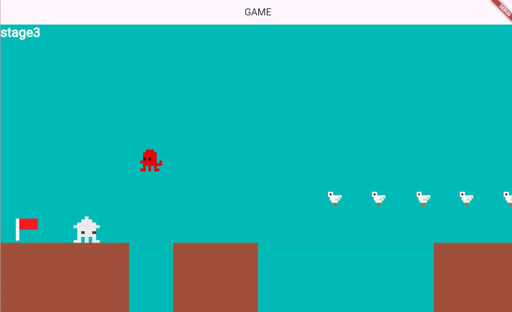
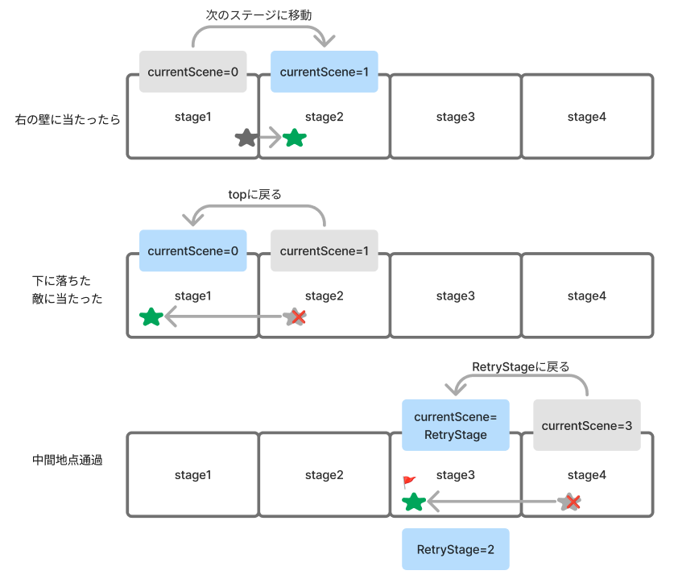

# **中間地点を表示**


## **フラグの表示**




**【setting.dart】**

必要なデータをリストで作成

### **①データ作成**

```dart

List<Map<String, dynamic>> flaglist = [
  {
    "idx": 0,
    "size_x": 50,
    "size_y": 50,
    "pos_x": PLAYER_SIZE_X,
    "pos_y": Y_GROUND_POSITION - PLAYER_SIZE_Y / 2,
    "flag_img": "redflag.png",
  },
];


```

**【game.dart】**

### **②class呼び出し**

```dart

// オブジェクトの描画
  switch (currentScene) {
      case 0:
        await add(teki(0)); //追加
        await add(teki(1)); //追加
        break;
      case 1:
        await add(triangle(0));
        await add(triangle(1));
        await add(teki(0));
        break;
      case 2:
        await add(flag(0));
        await add(hole(0));
        await add(hole(1));
        await add(teki(0));
        break;
      case 3:
        await add(step(0));
        await add(step(1));
        await add(teki(0));
        break;
      default:
    }


```

**【object.dart】**

### **　③flagクラスを作る**

```dart

class flag extends SpriteComponent
    with HasGameRef<MainGame>, CollisionCallbacks {
  flag(this.num);
  int num;
  @override
  Future<void> onLoad() async {
    sprite = await gameRef.loadSprite(flaglist[num]["flag_img"]);
    size = Vector2(flaglist[num]["size_x"], flaglist[num]["size_y"]);
    position = Vector2(flaglist[num]["pos_x"], flaglist[num]["pos_y"]);
    anchor = Anchor.center;

    add(RectangleHitbox());
  }
}

```


## **フラグに触れたら**

**①戻るステージを更新**

**【player.dart】**

```dart

@override
  void onCollisionStart(
    Set<Vector2> intersectionPoints,
    PositionComponent other,
  ) {
    
    if (other is triangle) {
      // 中間地点まで戻る
      currentScene = RetryStage;
      removeFromParent();
    }

    // 敵に当たったら
    if (other is teki) {
      //省略
    }

    //①フラグに当たったら
    if (other is flag) {
      // 中間地点まできたら更新
      RetryStage = currentScene;
    }

    super.onCollisionStart(intersectionPoints, other);
  }

```

