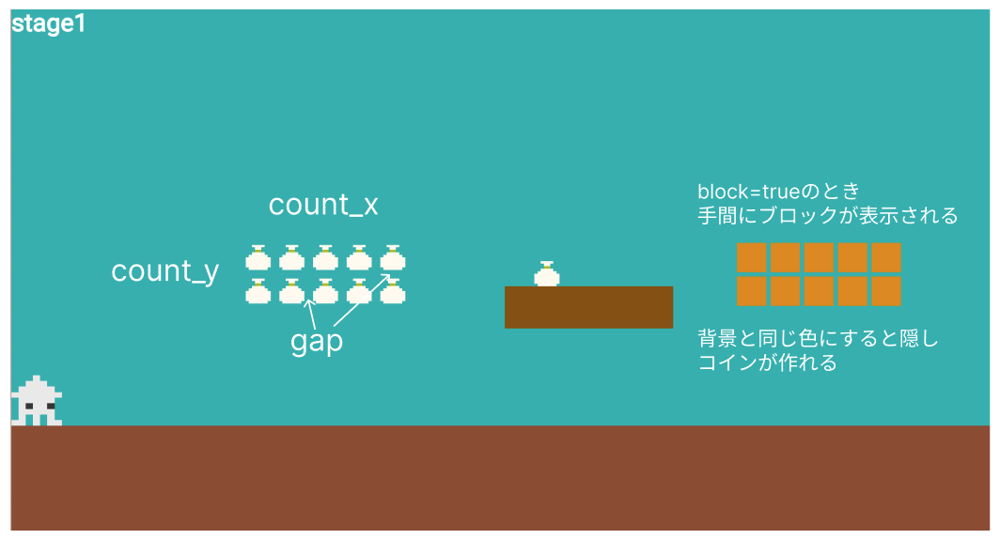

# **コイン、アイテムを追加**


## **コインの表示**


**【setting.dart】**

必要なデータをリストで作成

### **①データ作成**

```dart

List<Map<String, dynamic>> coinlist = [
  {
    "idx": 0,
    "color": Color.fromARGB(255, 226, 143, 0),
    "size_x": 30,
    "size_y": 30,
    "pos_x": screenSize.x / 2 + 50,
    "pos_y": screenSize.y / 2 - 15,
    "coin_img": "coin.png",
    "count_x": 1,
    "count_y": 1,
    "gap": 0,
    "block": false,
  },
  {
    "idx": 1,
    "color": Color.fromARGB(255, 226, 143, 0),
    "size_x": 30,
    "size_y": 30,
    "pos_x": screenSize.x / 4,
    "pos_y": Y_GROUND_POSITION - 200,
    "coin_img": "coin.png",
    "count_x": 5,
    "count_y": 2,
    "gap": 10,
    "block": false,
  },
  {
    "idx": 1,
    "color": Color.fromARGB(255, 226, 143, 0),
    "size_x": 30,
    "size_y": 30,
    "pos_x": screenSize.x * 3 / 4,
    "pos_y": Y_GROUND_POSITION - 200,
    "coin_img": "coin.png",
    "count_x": 5,
    "count_y": 2,
    "gap": 10,
    "block": true,
  },
];


```



**【game.dart】**

### **②class呼び出し**

複数のコインを表示するための関数を作る

```dart

// オブジェクトの描画
  switch (currentScene) {
      case 0:
        await coinRemove(0);  //追加
        await coinRemove(1);  //追加
        await coinRemove(2);  //追加
        break;
      case 1:
        await add(triangle(0));
        await add(triangle(1));
        await add(teki(0));
        break;
      case 2:
        await add(flag(0));
        await add(hole(0));
        await add(hole(1));
        await add(teki(0));
        break;
      case 3:
        await add(step(0));
        await add(step(1));
        await add(teki(0));
        break;
      default:
    }


```

```dart

Future<void> coinRemove(num) async {
  //指定した数分、縦横に並べる
  for (int i = 0; i < coinlist[num]["count_y"]; i++) {
    for (int j = 0; j < coinlist[num]["count_x"]; j++) {
      await add(coin(num, j, i));
      //blockがtrueの場合はblockクラスも呼び出す
      if (coinlist[num]["block"]) {
        await add(coin_block(num, j, i));
      }
    }
  }
}

```

**【object.dart】**

### **③coinクラスを作る**

```dart

class coin extends SpriteComponent
    with HasGameRef<MainGame>, CollisionCallbacks {
  coin(this.num, this.count_x, this.count_y);
  int num;
  int count_x;
  int count_y;

  @override
  Future<void> onLoad() async {
    
    sprite = await gameRef.loadSprite(coinlist[num]["coin_img"]);
    size = Vector2(coinlist[num]["size_x"], coinlist[num]["size_y"]);
    position = Vector2(
        coinlist[num]["pos_x"] +
            (coinlist[num]["gap"] + coinlist[num]["size_x"]) * count_x,
        coinlist[num]["pos_y"] +
            (coinlist[num]["gap"] + coinlist[num]["size_y"]) * count_y);
    anchor = Anchor.center;

    add(RectangleHitbox());
  }
}

```

### **④coin_blockクラスを作る**

```dart

class coin_block extends RectangleComponent
    with HasGameRef<MainGame>, CollisionCallbacks {
  coin_block(this.num, this.count_x, this.count_y);
  int num;
  int count_x;
  int count_y;

  @override
  Future<void> onLoad() async {
    paint = Paint()..color = coinlist[num]["color"];
    size = Vector2(coinlist[num]["size_x"] + 5, coinlist[num]["size_y"] + 5);
    position = Vector2(
        coinlist[num]["pos_x"] +
            (coinlist[num]["gap"] + coinlist[num]["size_x"]) * count_x,
        coinlist[num]["pos_y"] +
            (coinlist[num]["gap"] + coinlist[num]["size_y"]) * count_y);
    anchor = Anchor.center;
    add(RectangleHitbox());
  }

  @override
  Future<void> render(Canvas canvas) async {
    super.render(canvas);
  }
}

```


## **コインに触れたら**

**①coinが消える**  
**②blockが消える**

**【player.dart】**

onCollisionStart関数の中に追加

```dart

@override
  void onCollisionStart(
    Set<Vector2> intersectionPoints,
    PositionComponent other,
  ) {
    
    //省略

    if (other is flag) {
      // 中間地点まできたら更新
      RetryStage = currentScene;
    }

    //①otherをつけて、playre側からcoinを消す
    if (other is coin) {
      other.removeFromParent();
    }

    //②otherをつけて、playre側からblockを消す
    if (other is block) {
      other.removeFromParent();
    }


    super.onCollisionStart(intersectionPoints, other);
  }

```

このままだと、blockとcoinが同時に消えてしまう・・・・  
blockが消えたあと、少し待ってからcoinを消せるようする

**データを整理してみよう**  
coinデータは下の図のようになっている


**③blockが消えてからの処理**


**【player.dart】**
onCollisionEndに処理を追加

```dart

void onCollisionEnd(PositionComponent other) {
    isCollidedScreenHitboxX = false;
    isCollidedScreenHitboxY = false;

    if (other is coin_block) {
      //③条件に一致するデータ抽出matchingCoinsに代入
      final matchingCoins = gameRef.children.whereType<coin>().where((coin) =>
          coin.num == other.num &&
          coin.count_x == other.count_x &&
          coin.count_y == other.count_y);
      //③該当があれば0.5秒後にisCoinremovをtrueにする
      for (var coin in matchingCoins) {
        Future.delayed(Duration(milliseconds: 500), () {
          coin.isCoinremove = true;
        });
      }
    }

    super.onCollisionEnd(other);
  }

```

**【player.dart】**

onCollisionStartの中

```dart

if (other is coin) {
  //③条件追加
  if (other.isCoinremove) {
    other.removeFromParent();
  }
}

```

**【object.dart】**

```dart

class coin extends SpriteComponent
    with HasGameRef<MainGame>, CollisionCallbacks {
  coin(this.num, this.count_x, this.count_y);
  int num;
  int count_x;
  int count_y;

  //③追加 
  bool isCoinremove = false;

  @override
  Future<void> onLoad() async {
    //③追加　setting.dartのblockの値がfalseのとき（blockがない場合）は常に消せる 
    if (!coinlist[num]["block"]) {
       isCoinremove = true;
     }
    sprite = await gameRef.loadSprite(coinlist[num]["coin_img"]);
    size = Vector2(coinlist[num]["size_x"], coinlist[num]["size_y"]);
    position = Vector2(
        coinlist[num]["pos_x"] +
            (coinlist[num]["gap"] + coinlist[num]["size_x"]) * count_x,
        coinlist[num]["pos_y"] +
            (coinlist[num]["gap"] + coinlist[num]["size_y"]) * count_y);
    anchor = Anchor.center;

    add(RectangleHitbox());
  }
}

```
