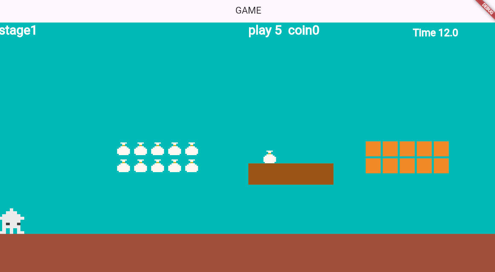

# **スコアーとタイマーを表示する**


## **スコアー表示**




**【text.dart】**


### **①スコアーの表示**

```dart

class scoretext extends TextComponent with HasGameRef<MainGame> {
  @override
  Future<void> onLoad() async {
    position = Vector2(screenSize.x / 2, 0);
    text = "play ${playercount}  coin${coincount}  ";

    textRenderer = TextPaint(
        style: TextStyle(
            fontSize: 30, fontWeight: FontWeight.bold, color: Colors.white));
  }

  @override
  Future<void> render(Canvas canvas) async {
    super.render(canvas);
  }
}

```

**【game.dart】**

### **②class呼び出し**

TextRemove関数に追加する

```dart

// プレーヤーのHP
var playercount = 5;
// コインの数
var coincount = 0;


//省略

// テキストの描画
  Future<void> TextRemove() async {
    children.whereType<NextText>().forEach((text) {
      text.removeFromParent();
    });
    //⭐️追加
    children.whereType<scoretext>().forEach((text) {
      text.removeFromParent();
    });
    await add(NextText());
    await add(scoretext()); //⭐️追加
  }

```

**【player.dart】**

### **③敵に当たった時HPをマイナス**

```dart

// 敵に当たったら
    if (other is teki) {
      // 落下中ではない
      if (!isFall) {
        isOnGround = false;
        isInHole = true;
        hole_X = position.x;
        animation = hosoAnimation;
        velocity.y = -300;
        velocity.x = 0;
        size.x = PLAYER_SIZE_X / 2;
        add(TimerComponent(
          period: 1, // 1秒
          repeat: false, // 1回だけ実行d
          onTick: () {
            currentScene = RetryStage;
            //⭐️追加 HP減らす
            playercount--;
            removeFromParent(); // コンポーネントを削除
          },
        ));
      } else {
        velocity.y = -300;
        velocity.x = 100;
        add(TimerComponent(
          period: 1, // 1秒
          repeat: false, // 1回だけ実行d
          onTick: () {
            velocity.x = 0;
          },
        ));
      }
    }

```

### **④コインを取った時にコインの数を加算**

```dart

if (other is coin) {
  print("${other.count_x}/${other.count_y}");

  if (other.isCoinremove) {
    coincount++; //⭐️追加
    other.removeFromParent();
    gameRef.TextRemove(); //⭐️追加
  }
}

```

**【text.dart】**

### **⑤タイマーの表示**

```dart

class countTimer extends TextComponent with HasGameRef<MainGame> {
  late Timer _timer;
  late TextComponent _timerText;

  @override
  Future<void> onLoad() async {
    super.onLoad();

    _timer = Timer(10, onTick: () {});
    position = Vector2(screenSize.x - 200, 10);
    text = "Timer:0.0";
    textRenderer = TextPaint(
        style: TextStyle(
            fontSize: 24, fontWeight: FontWeight.bold, color: Colors.white));
    _timer.start();
  }

  @override
  void update(double dt) {
    super.update(dt);
    
    _timer.update(dt);

    elapsedTime += dt;

    text = "Time ${elapsedTime.toStringAsFixed(1)}";
  }
}


```

**【game.dart】**

### **⑥タイマーの表示**

```dart


// 経過時間
double elapsedTime = 0.0;

//省略

@override
  Future<void> onLoad() async {
    await super.onLoad();

    // 当たり判定用のコンポーネント
    await add(ScreenHitbox());

    // 背景の設定
    await ScreenRemove();
    // プレーヤーの設定
    await PlayerRemove();
    // テキストの描画
    await TextRemove();
    await objectRemove();
    //⭐️ タイマー描画
    await countTimerRemove();
  }

  Future<void> countTimerRemove() async {
    await add(countTimer());
  }

```

### **⑦ゴールのデータ設定**

**【setting.dart】**

```dart

List<Map<String, dynamic>> flaglist = [
  {
    "idx": 0,
    "size_x": 50,
    "size_y": 50,
    "pos_x": PLAYER_SIZE_X,
    "pos_y": Y_GROUND_POSITION - PLAYER_SIZE_Y / 2,
    "flag_img": "checkflag.png",
    "type": "check",//⭐️追加
  },
  //⭐️追加↓
  {
    "idx": 1,
    "size_x": 50,
    "size_y": 50,
    "pos_x": screenSize.x - 50,
    "pos_y": Y_GROUND_POSITION - PLAYER_SIZE_Y / 2,
    "flag_img": "redflag.png",
    "type": "goal",
  },
];

```

### **⑧ゴールのフラッグ呼び出し**

**【game.dart】**

```dart

switch (currentScene) {
    case 0:
      await add(flag(1));
      break;
    case 1:
      //省略
    default:
  }
}

```

### **⑨flagクラスにtypeを追加**

**【object.dart】**

```dart

class flag extends SpriteComponent
    with HasGameRef<MainGame>, CollisionCallbacks {
  flag(this.num);
  int num;

  var type = "";//⭐️追加
  @override
  Future<void> onLoad() async {
    type = flaglist[num]["type"];//⭐️追加
    sprite = await gameRef.loadSprite(flaglist[num]["flag_img"]);
    size = Vector2(flaglist[num]["size_x"], flaglist[num]["size_y"]);
    position = Vector2(flaglist[num]["pos_x"], flaglist[num]["pos_y"]);
    anchor = Anchor.center;

    add(RectangleHitbox());
  }
}

```

### **⑩ゴールフラッグに触れたら**

**【player.dart】**

onCollisionStartの中を修正

```dart

if (other is flag) {
  //⭐️追加 goalの場合を追加
  if (other.type == "goal") {
    gameRef.goaltextremove(); //ゴールの文字を出す
    stopMovement(); //動きを止める
    isGoal = true; //タイマーを止める
    removeFromParent();
  } else {
    // 中間地点まできたら更新
    RetryStage = currentScene;
  }
}

```

### **⑩ゴールの文字表示**


**【text.dart】**

```dart

class goaltext extends TextComponent with HasGameRef<MainGame> {
  @override
  Future<void> onLoad() async {
    position = Vector2(screenSize.x / 2, 50);
    text = "GOAL  ";

    textRenderer = TextPaint(
        style: TextStyle(
            fontSize: 30, fontWeight: FontWeight.bold, color: Colors.black));
  }

  @override
  Future<void> render(Canvas canvas) async {
    super.render(canvas);
  }
}

```


### **⑧ゴール呼び出し**

**【game.dart】**

```dart

// ゴール表示
  Future<void> goaltextremove() async {
    await add(goaltext());
  }

```
