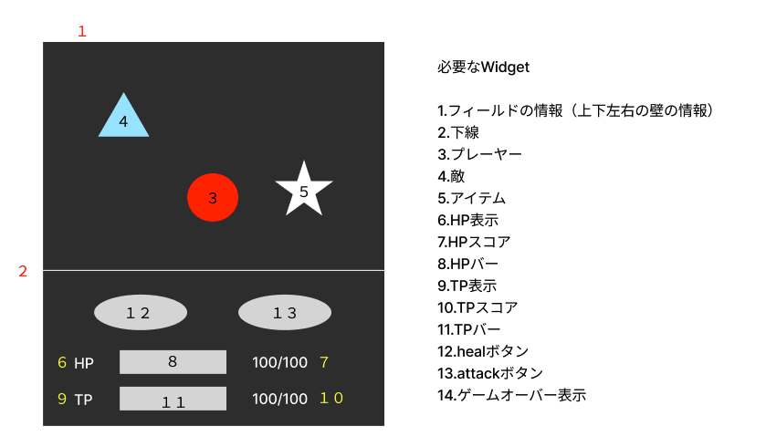
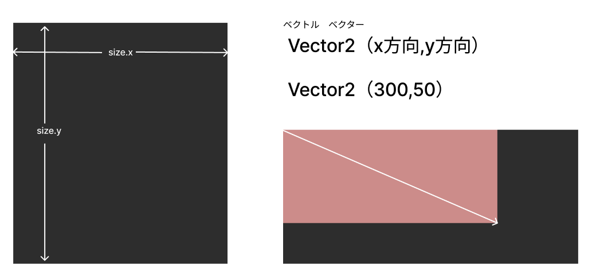

# **全ての機能をまとめる**

## **game.dart**

### **ワイヤーフレーム**



<br>

### **最初に知っておくこと**

Flutter Flameにはゲーム制作のために必要な描画や動作を制御するコンポーネントが用意されています

（参考）https://flame.tnantoka.com/examples/hello/#hello

<br>

**画面の読み込み**

常に画面が読み込まれる  
PCのフレームレート(fps)の単位

（見てみよう！）https://flame.tnantoka.com/examples/lifecycle/#lifecycle

<br>

**画面サイズの取得と方向**



<br>

### **ベースを作る**

**①FlameGameコンポーネントを使う**

`onLoad()`関数は一番最初に呼び出される関数

<br><br>

【game.dart】
```dart

//パッケージ追加
import 'package:flame/game.dart';

//ゲーム全体の動きを作る（メインのクラス）
class MainGame extends FlameGame {
  @override
  // --- 初期化 ---
  Future<void> onLoad() async {
    await super.onLoad();
  }
}

```


<br><br>

**②スクリーンに線を引く**

```dart
//パッケージ追加（図形を作るためのパッケージ）
import 'package:flame/components.dart';

Future<void> onLoad() async {
    await super.onLoad();

    // スクリーンに線を引く
    await add(RectangleComponent(
      position: Vector2(0, size.y - 200),
      size: Vector2(size.x, 1),
    ));
  }

```

**RectangleComponent**

https://flame.tnantoka.com/examples/rect/

<br>

**addでオブジェクトが作られる**


